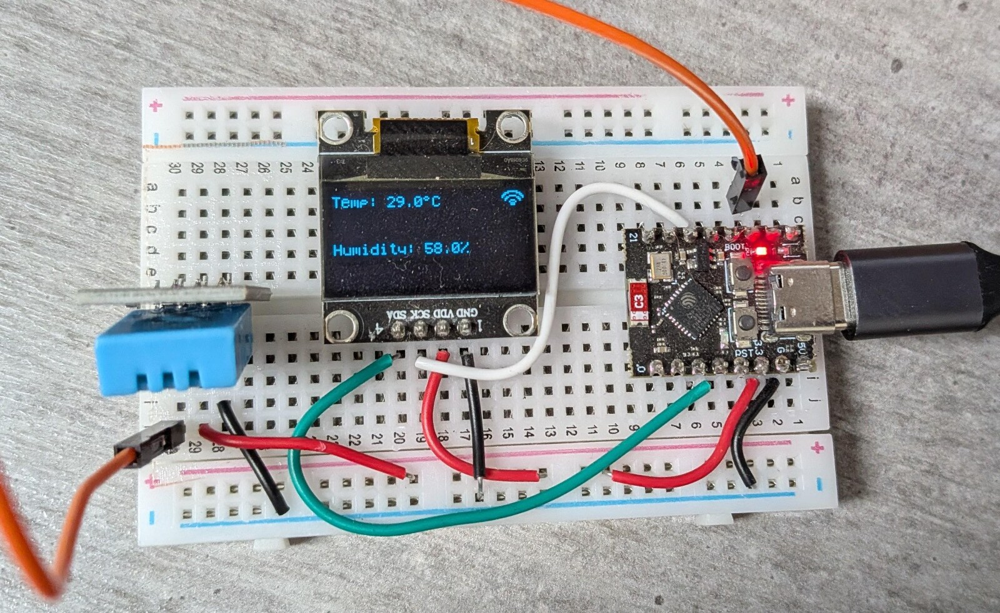
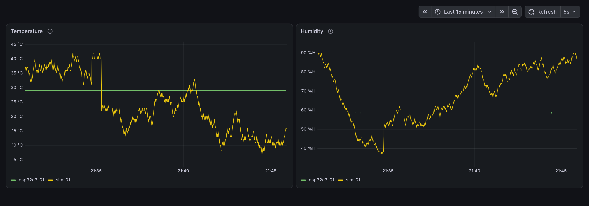

# ESP32-C3 → RabbitMQ → InfluxDB → Grafana

Learning project. The target is message broker mechanics — exchanges, queues,
bindings, acknowledgment, dead-lettering. The staged plan is the working document.

The two ends of that arrow:



*Stage 17. The OLED shows the cached reading and a link icon; the same reading
goes out over MQTT 5 at 1 Hz, QoS 1, as `esp32c3-01`.*



*Stage 13. Both publishers on both panels, 15 minutes at a 5 s refresh,
provisioned from a file. The step in the temperature trace is the stage's own
verify — the simulator's output range being changed and put back — and the break
just after it is a `docker compose down`/`up`, drawn as a gap rather than a line
across it.*

## Project Status

| Track | Stage | Status |
| --- | --- | --- |
| Software | 13 — **done** | A dashboard provisioned from a file, reading through a datasource and a DBRP mapping that are provisioned too. Underneath, `consumer_store` writes each reading between the parse and the ack; a failed write retries three times and then requeues — it never dead-letters |
| Hardware | 17 — **done** | MQTT 5 publisher, SNTP, outage policy and OLED link icon, all verified on hardware. Both halves of its Definition of Done are signed off: the MCU feeds both queues, and it renders on the dashboard as its own series |

The two tracks ran in parallel and met at the payload contract. Hardware work
lives in `firmware/` — see `firmware/README.md` for its build/flash/verification
steps, including the two one-time steps a new board needs before it will join the
network.

**Both tracks are now complete.** The MCU's payload matched the frozen contract
with no firmware change at any point, and `esp32c3-01` is a live series alongside
the simulator's `sim-01` — stored from stage 11, drawn from stage 13. **Stage 18,
end-to-end resilience, is the only stage left**, and it is the first that needs
both halves at once: nothing new gets built, the pipeline is broken deliberately
and watched.

## Setup

```bash
cp .env.example .env      # then edit the passwords, GRAFANA_PASSWORD included
openssl rand -hex 32      # paste into INFLUXDB_TOKEN in .env
uv lock                   # pyproject changed at stage 5 (paho-mqtt)
uv sync                   # creates .venv/ and installs the project editable
```

**Generate `INFLUXDB_TOKEN` before the first `docker compose up`.** From
InfluxDB 2.9 the token is hashed on disk and the plaintext cannot be recovered,
so a token InfluxDB invents for itself is one nothing else can ever use. Hex
rather than base64 keeps `/`, `+` and `=` out of a value that gets pasted into
`.env` and into curl commands. The same applies to `INFLUXDB_USERNAME` and
`INFLUXDB_PASSWORD`: like the broker's credentials, they are applied only on
first boot against an empty volume.

## Run modes

Both modes execute the same command against the same code. Only the resolved
configuration differs.

**Host mode** — modules run directly, against ports published by compose.
Run from the repository root; `.env` is resolved relative to the working directory.

```bash
uv run python -m telemetry.publisher
```

**Container mode** — the same module inside the compose network.

```bash
docker compose run --rm publisher
```

Configuration precedence is: process environment → `.env` → field default.
Compose loads `.env` wholesale for the Python services and then overrides the
hostnames per service, so `.env` holds only the host-mode values.

**`dbrp` and `grafana` are the exceptions**, from stage 12: neither takes an
`env_file`. They are not Python, they need four keys between them, and passing
those by hand keeps the broker credentials out of their environments.

From stage 11 that applies to `INFLUXDB_URL` as well as `RABBITMQ_HOST`, and
`consumer_store` is the one module that needs a real `INFLUXDB_TOKEN` — it exits
**5** with a message naming the variable if it is empty. The other three modules
start without one, deliberately, because they never touch storage.

## Verification

**[`docs/verification-log.md`](docs/verification-log.md)** holds how each stage
was checked, newest first: the commands, in the order they were run. It lived in
this file until stage 13, by which point it was ten times the length of the page
it was appended to.

Three documents, three jobs:

| Document | Holds |
|---|---|
| `mcu-rabbitmq-staged-plan.md` | each stage's Definition of Done — what "done" means before the work starts |
| `CLAUDE.md`, one per directory | what was actually verified, what it proved, and what was decided as a result. **The decision record** |
| `docs/verification-log.md` | how to re-run it |

## Layout

| Path | Purpose | Stage |
|---|---|---|
| `src/telemetry/config.py` | what differs between run modes: endpoints, credentials, this process's behaviour | 2 |
| `src/telemetry/topology_spec.py` | what the broker enforces: names and queue arguments, identical in every mode | 4 |
| `src/telemetry/logging_setup.py` | one logging configuration, shared; pins pika's logger | 4 |
| `src/telemetry/topology.py` | one-shot declarer; must complete before any publish | 4 |
| `tests/` | unit tests over the declared topology; no broker required | 4 |
| `src/telemetry/publisher.py` | software publisher standing in for the MCU | 5 |
| `src/telemetry/amqp.py` | shared AMQP plumbing: connect with retry, and the reconnecting consumer runner | 6 |
| `src/telemetry/payload.py` | the frozen payload contract: field names, types, and the validating parse() | 7 |
| `src/telemetry/consumer_observe.py` | observation path: bounded, lossy, no DLX | 6 |
| `src/telemetry/consumer_store.py` | durable path: manual ack, DLX, writes to InfluxDB | 6, 11 |
| `rabbitmq/rabbitmq.conf` | broker config; unknown keys abort startup | 3 |
| `rabbitmq/enabled_plugins` | management + MQTT; Erlang syntax, trailing period | 3 |
| `grafana/provisioning/` | datasource (12) and dashboard (13), mounted read-only; Grafana keeps no state of its own | 12, 13 |
| `influxdb/dbrp.sh` | one-shot declarer for the InfluxQL database mapping; idempotent | 12 |
| `firmware/` | ESP-IDF project (see `firmware/README.md`); `docs/` holds the driver API, the stage 17 diagrams and the photo above | 14–17 |
| `src/telemetry/docs/` | the dashboard image above | 13 |
| `docs/verification-log.md` | how every stage was checked, newest first | 13 |
