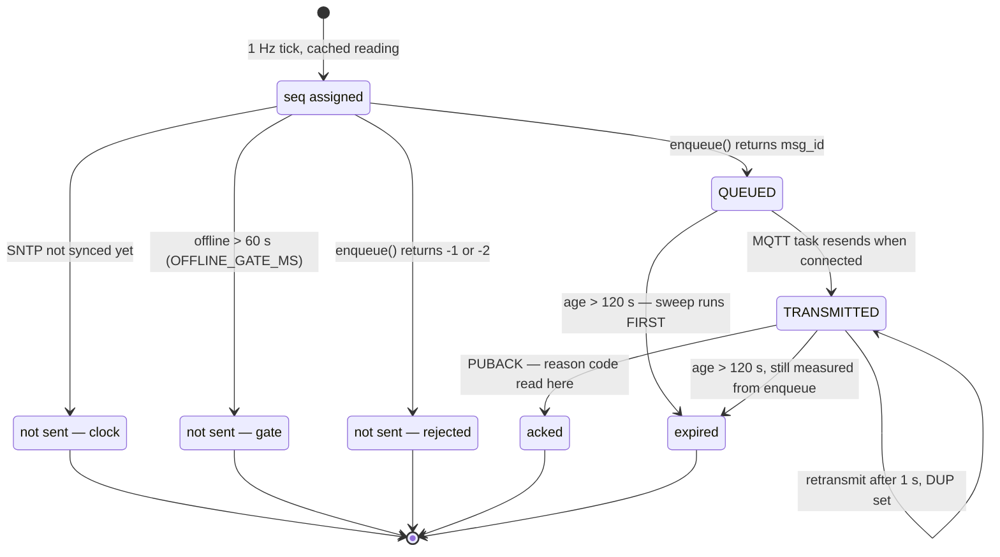
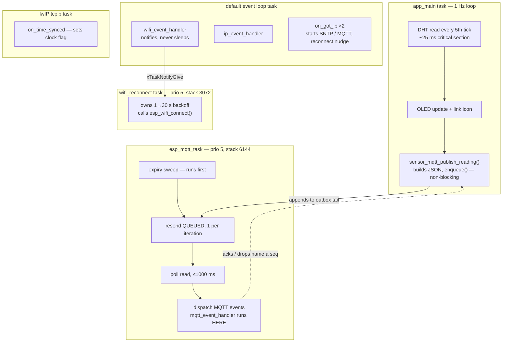

# Firmware mechanics — stage 17

Three diagrams, one per subject. Deliberately **not** one combined state
machine: connection state, per-message queue state and elapsed time are three
different things, and cross-producting them
(`connected` × `{queued,transmitted}` × `{<60s,<120s,>120s}`) produces a graph
nobody reads.

Everything here is drawn from the ESP-IDF v5.5.5 source and from hardware runs,
not from documentation. Decisions and their reasoning live in
`../CLAUDE.md`; this file is the picture of how the parts move.

---

## 1. Message lifecycle

One reading, from the tick that produced it to whatever became of it. This is
where all three subjects intersect.

`seq` is assigned **before** any guard, so it advances even for readings that
are never sent — a hole in the published series is exactly the set that was
lost.



The state names are not invented: the outbox tracks
`QUEUED → TRANSMITTED → ACKNOWLEDGED → CONFIRMED` in `pending_state_t`
(`lib/include/mqtt_outbox.h`). Only the first two are reached at QoS 1.

**Two transitions are counter-intuitive and are the reason this diagram exists.**

**`TRANSMITTED → expired` is legal, and has been observed.** seq 38-45 took
this path during the outage run: transmitted into a link that was already dead
but not yet reported as such, never acked, then deleted. See the blind window in
diagram 2. `outbox_set_tick()` is called in exactly
one place — the `publish()` write path (`mqtt_client.c:2272`). The resend path
used by `enqueue()` sets `TRANSMITTED` but never touches the tick
(`mqtt_client.c:1749-1767`). A message therefore carries its **original enqueue
timestamp** through transmission and while awaiting its PUBACK, so one near the
fuse can be deleted after the broker already has it — reporting a drop that did
not happen. This is why the 60 s application gate, not the expiry, is the
trustworthy record of what was lost.

**`QUEUED → expired` can beat `QUEUED → TRANSMITTED`, and has.** seq 66 was
deleted 430 ms into the replay, with the link already back, one place short of its
turn.
`mqtt_delete_expired_messages()` runs at the top of the MQTT task loop
(`mqtt_client.c:1664`), before the state switch that resends queued messages
(`1749`). A message past its fuse is deleted even if the link returned in that
same iteration.

**Reconnecting changes no message's state.** The outbox is one FIFO list;
`enqueue()` appends to the tail, the resend step takes the head. Replay is in
`seq` order and new readings queue behind the backlog. Measured: ~13 ms per
message at RSSI −76, ~10 ms at −75 replaying ~40 backlogged messages, ~400 ms at
−83. The 1 s poll timeout is never the binding constraint — PUBACK traffic keeps
the poll returning early.

**`-1` and `-2` reject the newest message; expiry discards the oldest.** Same
opposition as `drop-head` vs `reject-publish-dlx` on the broker side (stage 9).

---

## 2. Outage timeline

**Current policy: the 60 s gate is the only bound that drops anything.** The
outbox fuse is 1 h, so the diagram below describes the *superseded* 120 s
configuration — it is kept because it is the evidence the decision was made on,
and because the mechanism it shows is still live if the fuse is ever shortened
again.

Under today's settings the expected shape is simpler: the gate admits ~60
readings, everything after is dropped at source and logged, and the whole
backlog replays on reconnect no matter how long the outage lasted.

The gate and the expiry are **not** the same clock, and drawing them on one time
axis is the only way that becomes obvious. Numbers below are measured from the
stage 17 outage run under the 120 s fuse, re-based so t=0 is the moment the
Wi-Fi driver *reported* the loss (see the blind window, which is why that
wording matters).

```
      -8s      0s            60s          120s   126s      139s
       |        |             |             |     |          |
  .....+--------+-------------+-------------+-----+----------+
  BLIND|ENQUEUE |   GATE OPEN - dropped at source, each logged|
  WINDOW seq 38-|   seq 106-184  (79 readings)                |
  seq   105     |                                             ^
  38-45 (~60)   |                                        reconnect
                                                         got ip -> broker
  each queued message burns its OWN 120 s fuse, from ITS enqueue:      in 30 ms

  seq 38  |==========120 s=========> dies                 (never acked at all)
  seq 65  |     |==========120 s=========> dies t=138.7
  seq 66  |      |==========120 s=========> dies t=139.7  <-- 0.43 s AFTER
  seq 67  |       |==========120 s=========> survives         the link was back
                                             |
                                             +-> replayed, acked in ~10 ms each
```

Measured boundary, with under half a second of margin either side:

```
seq 65: queued 65059ms  fuse 185059ms  EXPIRED
seq 66: queued 66099ms  fuse 186099ms  EXPIRED   (link up at 185669ms)
seq 67: queued 67109ms  fuse 187109ms  acked @186689   <- survived by 420 ms
```

**This is the picture that refutes "the gate is below the expiry, so the expiry
never fires".** The gate bounds how *many* messages enter the outbox. It does
nothing about how *long* they wait. The last survivor of a buffered batch dies
`120 s - 60 s = 60 s` after the gate trips, not when the link returns.

Two regimes, both observed in the same run:

| | Duration | Gate drops | Expiry drops | Replayed |
|---|---|---|---|---|
| Outage 1 | 139 s | 79 | 29 | seq 67+ |
| Outage 2 | 23 s | 0 | 0 | **all — zero loss** |

So buffering only ever rescues outages **shorter than the fuse**. Outage 2 is
that case working perfectly; outage 1 is the fuse doing what a fuse does.

**Decided, and this data is why:** the fuse was raised to 1 h and demoted to a
memory backstop, leaving the gate as the sole data policy. Rationale — including
why the *broker*, not the firmware, should be the thing that drops — is in
`../CLAUDE.md` under "The outage policy".

### The blind window, and why t=0 above is not when the link died

The gate keys on MQTT session state, which lags reality. In outage 1 the last
successful ack was **seq 37**, but the driver only reported the loss 8.4 s later
(`reason=200`, beacon timeout). During that window `s_connected` was still true,
so the gate did not apply and publishes logged as ordinary `queued seq=N` with no
`(offline, within gate)` marker — **the log looked healthy while nothing was
getting through**. seq 38-45 were never acked and later expired.

Those eight are the `TRANSMITTED -> expired` transition from diagram 1, observed:
transmitted into a dead link, never acked, deleted still carrying their original
enqueue timestamps.

Consequence: the gate's 60 s runs from when the driver notices, so the real
worst case before readings start being dropped at source is **60 s plus the
beacon timeout**, not 60 s.

## 3. Task ownership

Which code runs on which task. The recurring rule this encodes: **never block
the default event-loop task.**



**Why the reconnect backoff has its own task** (stage 16): sleeping in the
disconnect handler would stall delivery of every other event on the default
loop. `esp_timer` was rejected for the same reason — its callbacks are expected
to last microseconds and share one high-priority task.

**Why `on_got_ip` is allowed on the event loop task**: both of its calls,
`esp_mqtt_client_start()` and `esp_mqtt_client_reconnect()`, are non-blocking.
Nothing there sleeps.

**Why the `msg_id → seq` map needs a mutex**: `pending_put()` is called from the
app task and `pending_take()` from the MQTT task, because esp-mqtt dispatches
its events from `esp_mqtt_task` via `run_event_loop()` (`mqtt_client.c:1662`) —
not from the default event loop. Two tasks, one array, so a real lock, held only
across a bounded scan and never across a network call or a log line.

**Why `enqueue()` and not `publish()`**: `esp_mqtt_client_publish()` sends in the
*calling* task and is documented as possibly blocking several seconds. In the
app task that would stall the DHT read and OLED update sharing the loop. The
arrow from `A3` to `M2` is the whole point — the app task only appends.

**Why one application task is still enough**: the C3 is single-core, the network
work already lives on `esp_mqtt_task`, and the cached reading never crosses a
task boundary. A second app task would add a mutex and a stack for no
parallelism.
